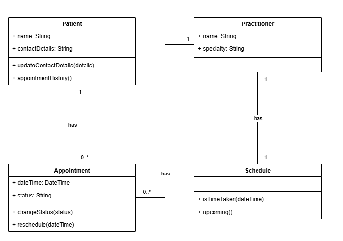

# SmartCare v0.3 – Domain Model Workbook

## Requirement-to-Concept Trace

| Requirement | Concept               | State/behaviour                                                         | Decision                                                   |
|-------------|-----------------------|-------------------------------------------------------------------------|------------------------------------------------------------|
| FR-01       | Patient               | Holds a name and contact details                                        | Class                                                      |
| FR-02       | Patient               | Matching a search against a name                                        | Operation over the collection of patients, not a class     |
| FR-03       | Practitioner          | Holds a name and a specialty                                            | Class                                                      |
| FR-04       | Appointment           | Holds a patient, a practitioner, and a date and time                    | Class                                                      |
| FR-05       | Schedule              | Answers whether a practitioner is already booked at a given time        | Class                                                      |
| FR-06       | Appointment           | Selecting the appointments that fall on one date                        | Operation over the collection of appointments, not a class |
| FR-07       | Appointment           | Holds a status and changes it when asked                                | Attribute and behaviour on Appointment                     |
| FR-08       | Appointment, Schedule | Changing an appointment's date and time once the new time is clear      | Behaviour on Appointment, checked through Schedule         |
| FR-09       | Patient               | Listing the appointments already held for that patient                  | Behaviour on Patient                                       |
| FR-10       | Schedule              | Listing a practitioner's upcoming appointments in time order            | Behaviour on Schedule                                      |
| FR-11       | Appointment           | Refusing to exist unless patient, practitioner and time are all present | Behaviour on Appointment                                   |
| FR-12       | Patient               | Replacing the stored contact details                                    | Behaviour on Patient                                       |

Every functional requirement is listed, including the two that produced no new
class.

## CRC Cards

### Patient

| Responsibilities                                                                       | Collaborators |
|----------------------------------------------------------------------------------------|---------------|
| Know its own name and contact details, and update them when they change (FR-01, FR-12) | None          |
| Provide its history of past appointments (FR-09)                                       | Appointment   |

### Practitioner

| Responsibilities                                                  | Collaborators         |
|-------------------------------------------------------------------|-----------------------|
| Know its own name and specialty (FR-03)                           | None                  |
| Hold its own appointments and provide its schedule (FR-04, FR-10) | Appointment, Schedule |

### Appointment

| Responsibilities                                                                                               | Collaborators         |
|----------------------------------------------------------------------------------------------------------------|-----------------------|
| Know its patient, its practitioner and its date and time, and refuse to exist without all three (FR-04, FR-11) | Patient, Practitioner |
| Know its own status and change it when asked (FR-07)                                                           | None                  |

### Schedule

| Responsibilities                                                                         | Collaborators             |
|------------------------------------------------------------------------------------------|---------------------------|
| Answer whether its practitioner is already booked at a given time (FR-05, FR-08, NFR-03) | Practitioner, Appointment |
| List its practitioner's upcoming appointments in time order (FR-10)                      | Practitioner, Appointment |

## UML Class Diagram

### Relationships and multiplicities

| From         | To          | Relationship | Multiplicity |
|--------------|-------------|--------------|--------------|
| Patient      | Appointment | One to many  | 1 to 0..\*   |
| Practitioner | Appointment | One to many  | 1 to 0..\*   |
| Practitioner | Schedule    | One to one   | 1 to 1       |

A patient holds any number of appointments, including none, and each
appointment belongs to one patient. The same is true of a practitioner. Each
practitioner has exactly one schedule, and a schedule belongs to one
practitioner.

## Design Rationale

**Class selection**

**Patient.** FR-01 creates a patient record with a name and contact details,
and FR-12 updates those details later. A patient exists on its own, before any
appointment is booked and after it is over, so it needs to be a class.

**Practitioner.** FR-03 creates a practitioner record with a name and a
specialty. Like a patient, a practitioner exists whether or not anything is
booked with them.

**Appointment.** FR-04 books one, FR-07 changes its status and FR-08 moves it
to a new time. It has details of its own, and it changes over time, so it is
more than just a link between a patient and a practitioner.

**Schedule.** FR-05 says a booking must be refused if the practitioner is
already busy at that time. To answer that, something has to look at all of
that practitioner's appointments together. One appointment only knows about
itself, so it cannot do this. Practitioner could, but then it would be doing
two jobs at once: describing a person, and checking a diary. Schedule does the
second one.

Two more requirements support it. NFR-03 says a conflicting booking must be
blocked in the data rather than only warned about on screen, which means the
check has to sit inside a class. NFR-05 says each core function must be
testable on its own, which is easier when the check has a class of its own.

Schedule here means a practitioner's whole diary, covering every appointment
they have, rather than one day's list.

**Responsibility allocation**

A class should answer questions about its own data.

| Class        | Answers questions about                                            | Requirements        |
|--------------|--------------------------------------------------------------------|---------------------|
| Patient      | One patient: its details, and its past appointments                | FR-01, FR-09, FR-12 |
| Practitioner | One practitioner: its details, and the appointments booked with it | FR-03, FR-04        |
| Appointment  | One booking: who it is for, when it is, and its status             | FR-04, FR-07        |
| Schedule     | Several appointments at once: whether a time is already taken      | FR-05, NFR-03       |

**Key relationships**

**Patient to Appointment, one to many.** A patient can have many appointments
and each appointment is for one patient. The lower bound is zero because FR-01
creates a patient record before any booking exists.

**Practitioner to Appointment, one to many.** FR-04 books a patient with one
named practitioner, so each appointment has exactly one. A practitioner with
nothing booked is still valid, so the lower bound is zero here too.

**Practitioner to Schedule, one to one.** Because a schedule is a
practitioner's whole diary rather than one day's list, each practitioner has
exactly one, from the moment the record is created and even while it is empty.
Schedule reads the appointments the practitioner already holds rather than
keeping its own copy of them.

## AI Design Review Record

| AI suggestion                             | Evidence | Decision | Reason                                             | Model change                |
|-------------------------------------------|----------|----------|----------------------------------------------------|-----------------------------|
| Allow a patient to have zero appointments | FR-01    | Accepted | A patient is created before any booking exists     | Lower bound set to zero     |
| An AppointmentManager class               | FR-05    | Modified | Only the clash check is work Appointment cannot do | Clash check became Schedule |
| A NotificationManager class               | None     | Rejected | Reminders are not confirmed                        | None                        |
| A ClinicController class                  | None     | Rejected | The clinic runs from one site                      | None                        |
| A ScheduleEngine class                    | None     | Rejected | Nothing asks the system to generate times          | None                        |
