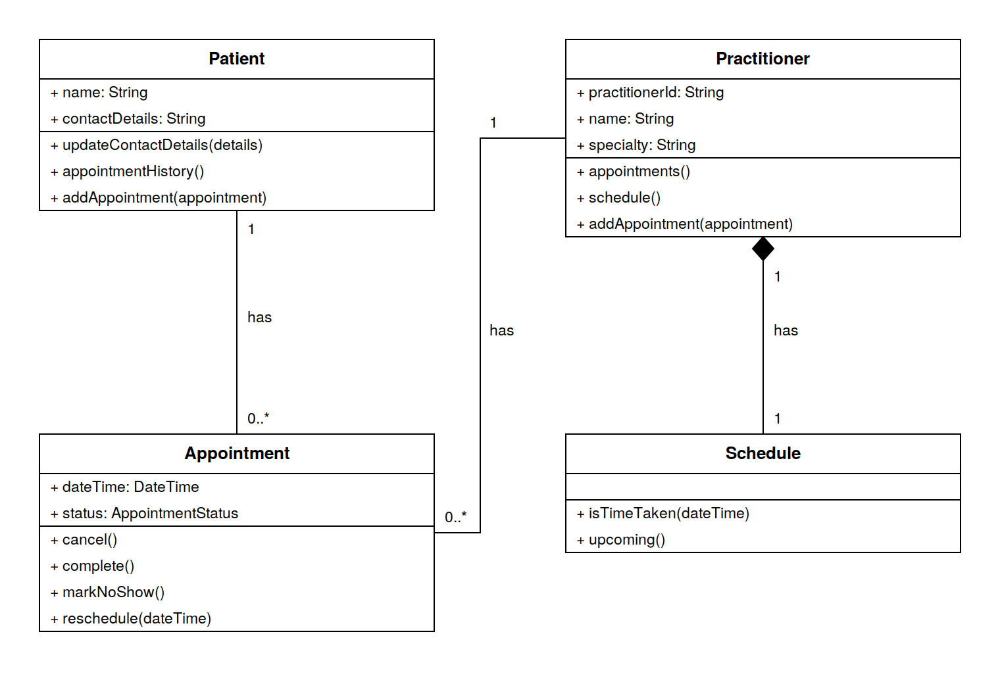

# SmartCare v0.4 - Domain Implementation Workbook

## 1. UML-to-Code Trace

| UML element                                                       | Python element                                           | Implemented? | Notes                                                                                                                                                                                             |
|-------------------------------------------------------------------|----------------------------------------------------------|--------------|---------------------------------------------------------------------------------------------------------------------------------------------------------------------------------------------------|
| Patient                                                           | class Patient                                            | Yes          | Name and contact details held as read-only properties (FR-01).                                                                                                                                    |
| Patient operations                                                | update_contact_details(), appointment_history()          | Yes          | update_contact_details() revalidates the new value (FR-12). appointment_history() returns a tuple so the record cannot be edited from outside (FR-09).                                            |
| Practitioner                                                      | class Practitioner                                       | Yes          | An identifier was added during implementation. See section 5.                                                                                                                                     |
| Practitioner operations                                           | appointments(), schedule()                               | Added        | The approved UML left these empty although the CRC card gives Practitioner both responsibilities (FR-04, FR-10). See section 5.                                                                   |
| Appointment                                                       | class Appointment                                        | Yes          | Status is now typed as AppointmentStatus rather than String. See section 5.                                                                                                                       |
| Appointment.changeStatus()                                        | cancel(), complete(), mark_no_show()                     | Modified     | Replaced by three named operations. See section 5.                                                                                                                                                |
| Appointment.reschedule()                                          | reschedule()                                             | Yes          | Refuses a time the practitioner already holds (FR-05, FR-08).                                                                                                                                     |
| Schedule                                                          | class Schedule with is_time_taken(), upcoming()          | Yes          | Created by its practitioner and reached through it. upcoming() lists appointments still booked; is_time_taken() treats any appointment except a cancelled one as holding its time (FR-05, FR-10). |
| Patient 1 to 0..* Appointment, Practitioner 1 to 0..* Appointment | add_appointment(), appointment_history(), appointments() | Yes          | Both lists start empty, matching the lower bound of zero.                                                                                                                                         |
| Practitioner 1 to 1 Schedule                                      | Practitioner.schedule()                                  | Yes          | One schedule per practitioner, created in the constructor.                                                                                                                                        |

## 2. Domain Invariants

| Class                 | Invariant / rule                                                                                                  | How protected                                                                                                                                           |
|-----------------------|-------------------------------------------------------------------------------------------------------------------|---------------------------------------------------------------------------------------------------------------------------------------------------------|
| Patient               | Name and contact details are never empty (FR-01, FR-12)                                                           | Checked when the record is created and whenever details are updated. Both are read-only properties.                                                     |
| Practitioner          | Name and specialty are never empty (FR-03), and so is the identifier added during implementation                  | Checked in the constructor. All three are read-only properties.                                                                                         |
| Appointment           | A booking has a patient, a practitioner and a time (FR-11)                                                        | The constructor refuses the booking if any of the three is missing.                                                                                     |
| Appointment           | Status is one of four values and only changes from booked (FR-07, US-04)                                          | An enum holds the four values. Status is read-only, and each of the three change methods refuses unless the appointment is still booked.                |
| Appointment           | A practitioner never holds two appointments at the same time unless the earlier one was cancelled (FR-05, NFR-03) | The schedule is checked when the appointment is created and again when it is rescheduled.                                                               |
| Patient, Practitioner | Stored appointments cannot be removed by a caller (FR-09)                                                         | Both return a tuple rather than the list, and refuse an appointment that names someone else. No attribute can be replaced through the public interface. |

## 3. Composition / Inheritance Decisions

| Relationship                     | Decision                            | Rationale                                                                                                                                                                         |
|----------------------------------|-------------------------------------|-----------------------------------------------------------------------------------------------------------------------------------------------------------------------------------|
| Patient to Appointment           | Association                         | An appointment refers to a patient rather than being part of one. FR-09 keeps past appointments as history, so an appointment is not destroyed with the record that refers to it. |
| Practitioner to Appointment      | Association                         | FR-03 creates a practitioner record on its own, before any booking exists, and that record stays once the appointment is completed or cancelled.                                  |
| Practitioner to Schedule         | Composition                         | A practitioner creates its own schedule in its constructor, and no other class in the model holds one. A schedule has no meaning without the practitioner whose diary it is.      |
| Appointment to AppointmentStatus | Attribute, not a class relationship | Status is one of four fixed values held by an appointment. An enum gives those values a name without making them an object with behaviour.                                        |
| Doctor to Practitioner           | Inheritance, not built              | A doctor is a kind of practitioner, so inheritance would be correct. Nothing in the requirements says practitioner types behave differently, so it was not added.                 |

## 4. AI Pair-Programming Record

| AI contribution                                          | Conforms? | Decision | Reason                                                                                                            | Verification                                                                                                                                                                                                    |
|----------------------------------------------------------|-----------|----------|-------------------------------------------------------------------------------------------------------------------|-----------------------------------------------------------------------------------------------------------------------------------------------------------------------------------------------------------------|
| An AppointmentStatus enum                                | Yes       | Accepted | It implements the enum agreed before the prompt, with exactly the four values FR-07 allows.                       | Listed the enum values and compared them with FR-07.                                                                                                                                                            |
| Status as a public attribute                             | No        | Rejected | Any caller could set it and step around US-04.                                                                    | Made it read-only, then confirmed that assigning to it raises an error.                                                                                                                                         |
| A single change_status(status) method                    | No        | Modified | It takes whatever value the caller supplies, so US-04 cannot be enforced.                                         | Replaced with cancel(), complete() and mark_no_show(). Tested legal and illegal transitions, including repeated cancellation and attempts to complete, mark as a no-show or reschedule a cancelled appointment. |
| Validation of patient, practitioner and time on creation | Yes       | Accepted | FR-11 refuses a booking that is missing any of the three.                                                         | Created an appointment with each field missing in turn. All three were refused.                                                                                                                                 |
| A NotificationManager call inside cancel()               | No        | Rejected | Reminders are provisional and have not been confirmed by the client.                                              | Removed it. No reference to it remains in the file.                                                                                                                                                             |
| Inheritance from a PatientRecord class                   | No        | Rejected | An appointment is not a kind of patient record, and inheriting would copy a patient's details into every booking. | Replaced with a reference to a Patient object. No domain class inherits from another; DomainError and AppointmentStatus inherit only from Python's Exception and Enum.                                          |

## 5. Updated UML

Implementation revealed six justified changes to the model. The updated diagram follows the table.

| Change                                                           | Reason                                                                                                                                                                  |
|------------------------------------------------------------------|-------------------------------------------------------------------------------------------------------------------------------------------------------------------------|
| Practitioner gains practitionerId                                | The implementation task asks for an identifier. It distinguishes practitioners who may share the same name.                                                             |
| Practitioner gains appointments() and schedule()                 | The approved UML left Practitioner with no operations, although its CRC card makes holding its appointments and providing its schedule responsibilities (FR-04, FR-10). |
| changeStatus() replaced by cancel(), complete() and markNoShow() | A single method that takes any value leaves the decision with the caller, so US-04 cannot be enforced. Named methods let the appointment check its own status first.    |
| status typed as AppointmentStatus rather than String             | FR-07 allows exactly four status values. A string accepts anything, while an enum holds only those four.                                                                |
| addAppointment() added to Patient and Practitioner               | Both sides of the association have to be kept in step. The method refuses an appointment that names someone else, so the link cannot be made wrongly.                   |
| Practitioner to Schedule shown as composition                    | A practitioner creates its own schedule in its constructor and no other class in the model holds one, which is stronger than a plain association.                       |

